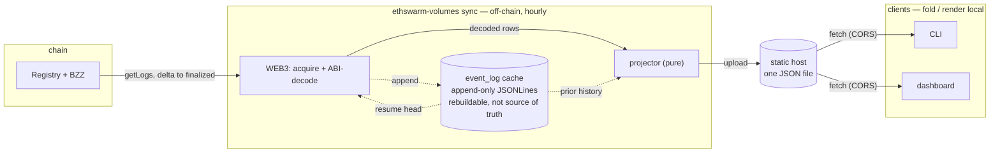

# Volume Registry Data API — Architecture

The architecture of the data API wrapping the `VolumeRegistry` contract. It covers components, data flow, the web3-isolation seam, and delivery. The goal and the three measures are in [`README.md`](./README.md); the data model in [`data-model/`](./data-model/); the client interface in [`CLIENT.md`](./CLIENT.md); the versioning & upgrade path in [`VERSIONING.md`](./VERSIONING.md); the wire format in [`SCHEMA.md`](./SCHEMA.md); decision rationale in [`adr/`](./adr/).

## 1. Components

- **Indexer (`ethswarm-volumes sync`)** — the only stateful process; runs offline, hourly ([ADR-0002](./adr/0002-finalized-only-indexer.md)). A walled-off **web3 layer** (RPC + ABI decode) reads logs via `eth_getLogs` to the chain's `finalized` block and lands decoded rows in [`event_log`](./data-model/event-log.md); a **web3-free projector** folds `event_log` into the artifact and publishes it.
- **Artifact** — one JSON file ([`SCHEMA.md`](./SCHEMA.md)). The contract between indexer and clients.
- **Clients** — CLI (`ethswarm-volumes stat`) and web dashboard. Both read the *same* artifact and do all windowing, bucketing, and fiat conversion locally. Two thin renderers over one data contract ([`CLIENT.md`](./CLIENT.md), [ADR-0009](./adr/0009-client-side-folding.md)).

The data model behind the indexer — the deployment registry, the `event_log`, and the pure projection — is specified in [`data-model/`](./data-model/).

## 2. The web3-isolation boundary

All web3-dependent code — RPC, the eth API, and ABI decoding — lives in one layer whose only output is decoded, web3-free rows in the per-event-type [`event_log`](./data-model/event-log.md). Everything downstream consumes `event_log` alone. `event_log` is the boundary. See [ADR-0003](./adr/0003-web3-isolation.md).

The web3 decoder layer comprises two stages:

1. Generic eth API decode via a trusted ABI library (`eth-abi` / web3.py) driven with the compiled contract ABI.

   This makes the per-version compiled ABI a build dependency of `sync`.

2. Label ABI param names and enum integers to match the source.

This is one of the two clean seams of the system (§4). The row shape it produces and the on-disk store behind it are specified in [`data-model/event-log.md`](./data-model/event-log.md).

## 3. Delivery

- The artifact is a single static file. Publish to any static host with a CDN (object store, static pages, IPFS, or Swarm itself), permissive CORS for browser fetches, and a cache TTL matching the refresh cadence ([ADR-0007](./adr/0007-static-artifact-delivery.md)).
- Public traffic is absorbed by the CDN; the request path is a static fetch.
- **Build order:** local indexer → local artifact file → client reading a local path; the URL / CDN source follows.

## 4. Symmetries

- Three measures × identical temporal access patterns (as-of / window / series); flow-vs-stock is the one structural difference.
- One artifact, two renderers (CLI / dashboard) with shared option semantics.
- Stable public contract (artifact) over per-version private decode (the per-deployment, per-event-type [`event_log`](./data-model/event-log.md) + the projector selected by `registry_version`).
- The web3 layer acquires per event type, the store keeps per event type, and the projector merges only the logs each measure needs — one shape across acquisition, storage, and read.
- Two clean seams: `event_log` separates web3 from everything else (§2); the artifact separates the indexer write path from the client read path.
